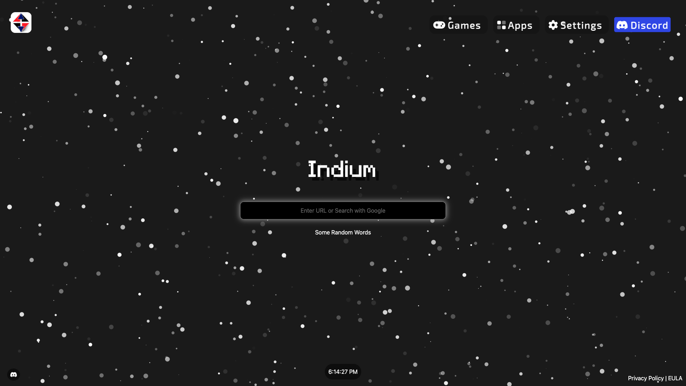

# <center></center> Indium

Welcome to Indium. This proxy is designed for speed and customization. As well as evading internet censorship.



## Key Features

| Features||
| -------- | ------- |
| Tab Cloaking  | about:blank Cloaking  |
| All Games From Hypackel Games | Bunch of apps |
| Hiding site from browser history| No Ads|
| Appearence Customization |

## Developers

- [Hypackel](https://github.com/Hypackel)

### Deployment Alternatives

For more deployment options, join our [Discord Server](https://discord.hypackel.com) for various ways to deploy Indium.
This includes methods of deploying to Render/OnRender.

### GitHub Codespaces

1. Create a GitHub account if you haven't already.
2. Click "Code" (green button) and then "Create Codespace on main."

```
pnpm i && pnpm start
```

3. In the terminal at the bottom, paste `pnpm i && pnpm start`.
4. Respond to the application popup by clicking "Make public."
> [!IMPORTANT]
> Make sure you click the "Make public." button, or the it won't function properly.
5. Access the deployed website from the ports tab.
6. For subsequent uses in the same codespace, just run `pnpm start`

### Solution for if there is no popup

1. Run `pnpm i`, and before `pnpm start`, prepend `PORT=8080`, replacing 8080 with another port. For example, `PORT=6969 pnpm start`.
2. If this does not work then you can prepend `$env:PORT=8080;`, replacing 8080 with another port. For example, `$env:PORT=6969; pnpm start`
3. Go to the ports tab, Click Forward A Port, And type the port number.
4. Right-click Visibility and set Port Visibility to Public.

## Discord

[](https://discord.hypackel.com) 


## TODO

- [x] Make Right Click menu on all pages
- [x] make right click menu work
- [x] Fix Search on games page
- [x] Add Themes
- [10%] Put The Game Images Locally so it wont be blocked
- [ ] Release the proxy
- [ ] Remove the Unnecessary Files
- [ ] Put Docker Images
- [ ] Make More Tutorials only on discord
- [x] Finish fragmenting the games
